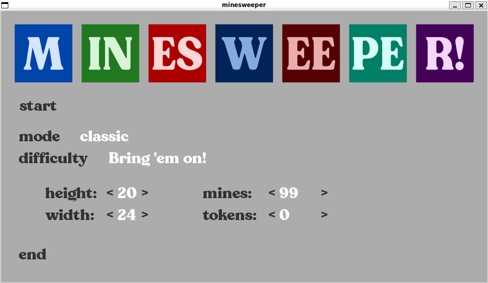
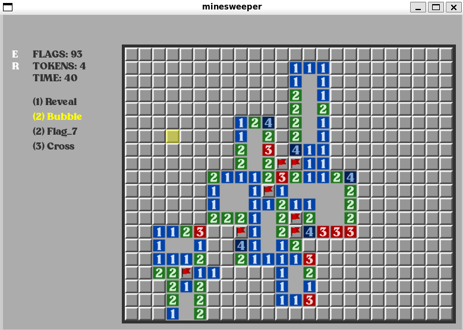

# Power-up Minesweeper




A modern take on the classic Minesweeper game for the **BI-PYT** course. This version enriches traditional gameplay with an optional bonus mode where you collect tokens across the board to purchase tactical power-ups. These abilities help lower the need for random guessing by safely flagging hidden mines or uncovering clean tiles.

---

## Project Structure

- `main.py` - The primary application entry point located in the root directory.
- `src/` - Contains the foundational python core modules (`game.py`, `menu.py`, etc.).
- `assets/` - Game asset repositories:
  - `fonts/` - Features the customized *NT Wagner* typography used throughout the UI.
  - `sprites/` - Storage for custom-designed tile textures, modernized vector mine icons, and the game logo.
- `tests/` - Unit tests split into dedicated modules matching their source code components.
- `report.pdf` - The detailed project documentation report written in Czech.

---

## Getting Started

### Prerequisites
The application relies on `NumPy` array matrix grids and the `Pygame` engine wrapper to render the visual windows:

```bash
pip install pygame numpy pytest
```

### Execution
Run the following command from the root directory to open the main menu:

```bash
python3 main.py
```

### Controls

- **Left-Click:** Open a sealed tile / Apply selected power-up
- **Right-Click:** Place or remove a protective flag to prevent accidental detonation. Clicking an open number tile with adjacent flags correctly placed clears the remaining unflagged neighbors.

---

## Game Features and Mechanics

### Game Mode and Difficulty Customization

The main menu lets you play standard Minesweeper or activate the tactical Power-up mode. It includes four pre-defined difficulties (using nostalgic naming schemes borrowed from Wolfenstein 3D) or a fully adjustable custom grid size:

- **Grid Constraints:** Supports grid boundaries from $9\times9$ up to $40\times70$ tiles.

- **Intelligent Configuration:** Set a minimum of 10 mines. When dialing numbers in the settings, a **Left-Click** changes values by ±1, a **Right-Click** increments by ±5, and clicking the **Mouse Scroll Wheel** snaps the parameter immediately to its minimum or maximum limit.

### Grid Generation Logic

To prevent frustrating, instant losses, the game uses delayed generation. The board arrays initialize completely empty. The moment you make your first left-click, the engine randomly distributes mines and tokens, guaranteeing that your starting tile is always a safe space. Safe empty areas are instantly opened using a flood-fill algorithm modified into a fast Breadth-First Search (BFS) layout.

### The Power-up Economy

When playing the bonus mode, a set number of currency tokens are hidden under random safe tiles. Uncovering those tiles collects the tokens. You can spend your bank balance on four different power-up tiers, highlighted in white when affordable:

| Power-up Name | Token Cost | Functional Mechanism / Tool Description |
| :--- | :---: | :--- |
| **Reveal** | `1` | Safely tests a single high-risk cell. Automatically places a flag if a mine is present, or opens the tile safely if it is clear. |
| **Bubble** | `2` | Triggers a fresh flood-fill reveal starting from a random hidden empty area on the board. |
| **Flag 7** | `2` | Instantly and correctly flags 7 random hidden mines anywhere across the map. |
| **Cross** | `3` | Directly clears a selected tile and shoots out a horizontal and vertical scanning beam that safely clears all safe tiles up to a distance of 2 spaces. |

---

## Testing Layout

The test suites evaluate your modules automatically using the `pytest` testing ecosystem. To discover and execute all unit checks, run the following command in your terminal:

```bash
pytest
```